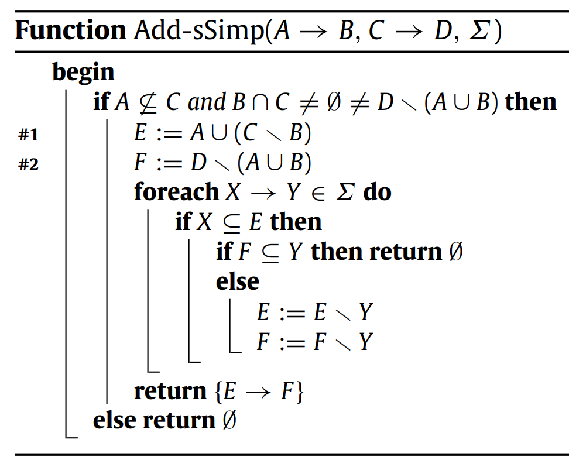
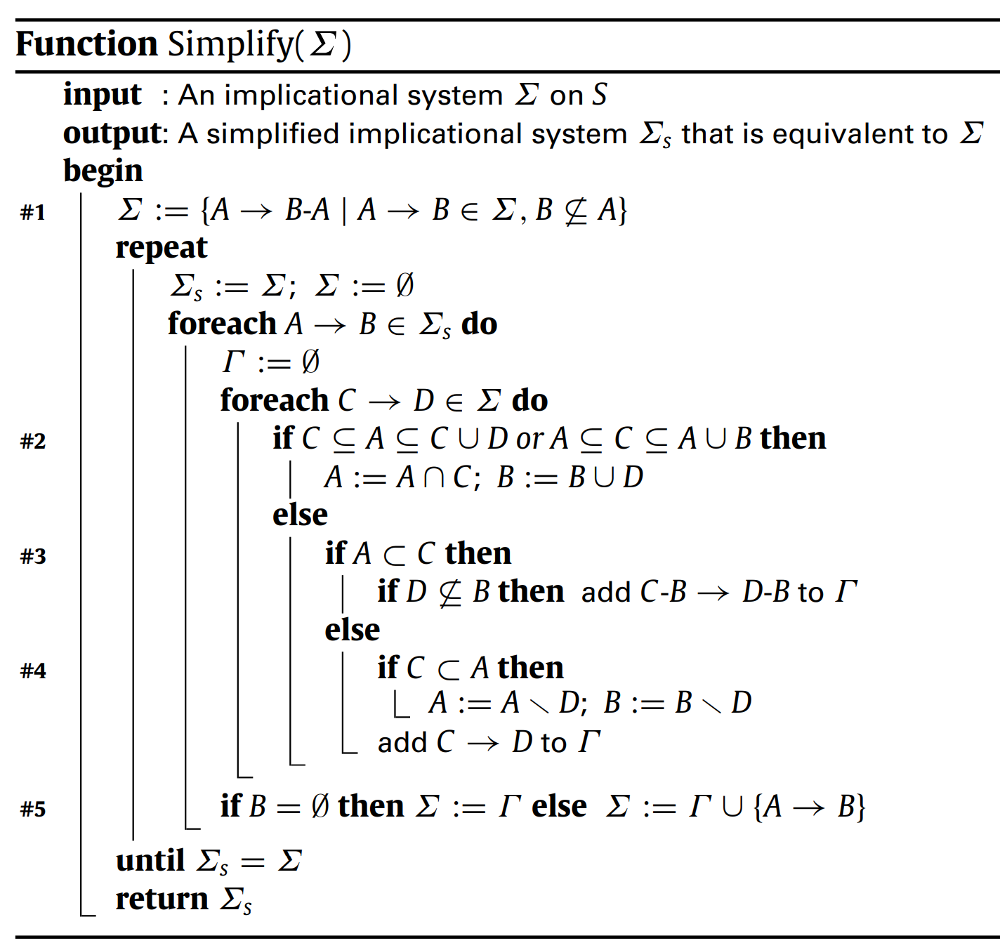
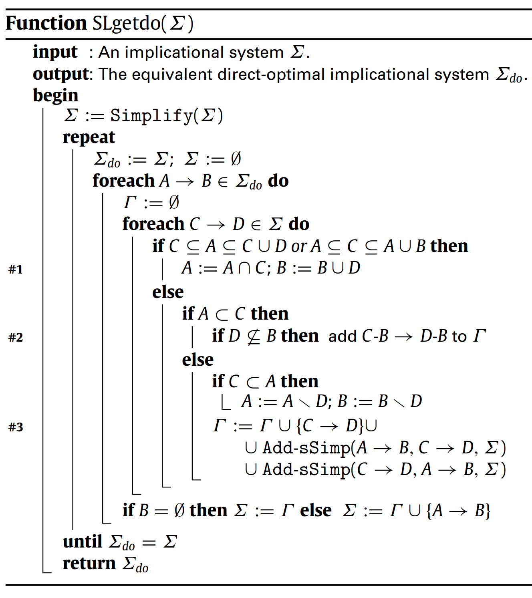
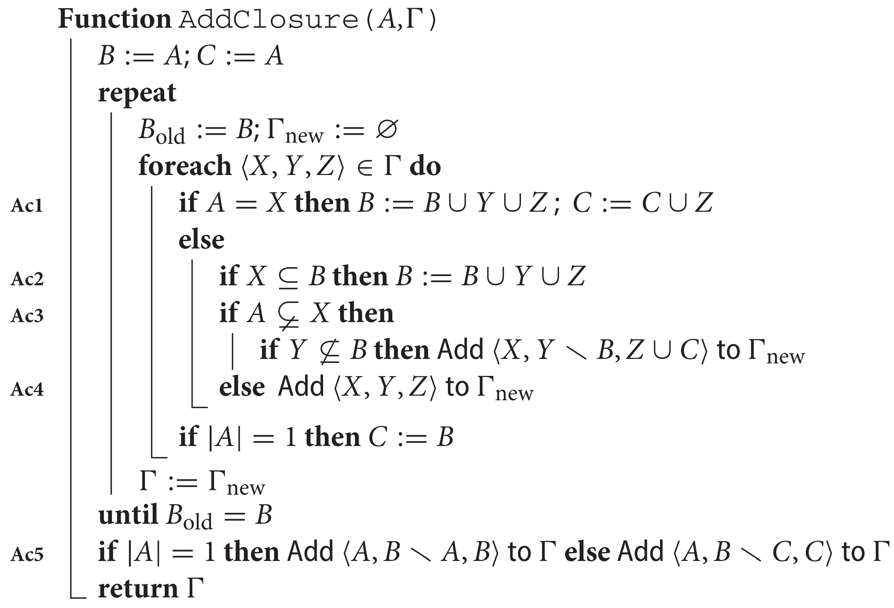
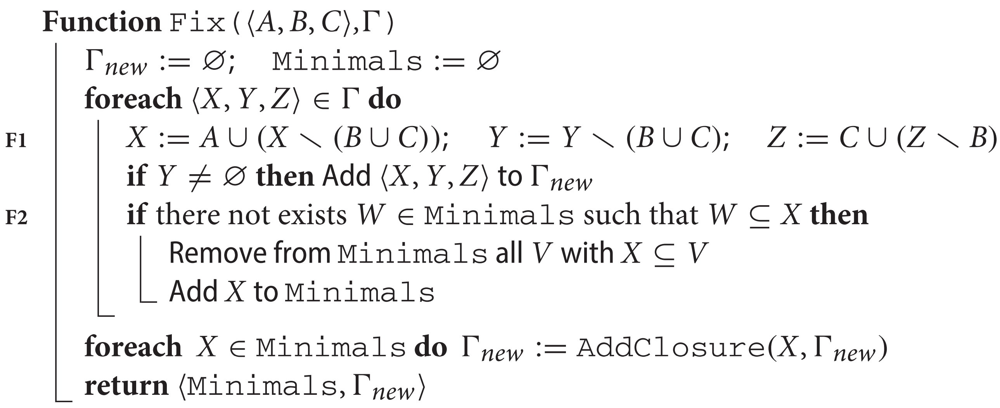
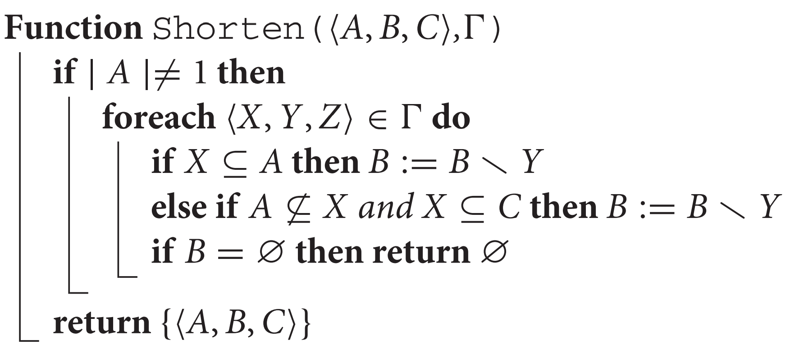
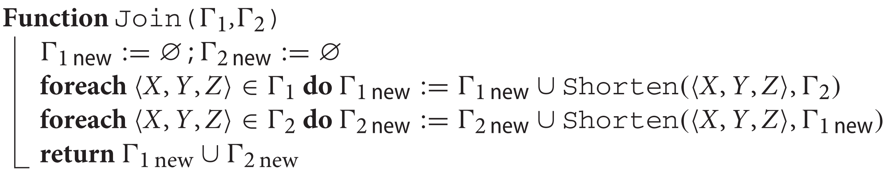
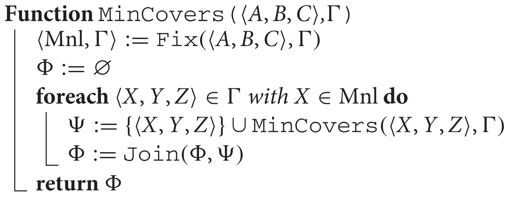
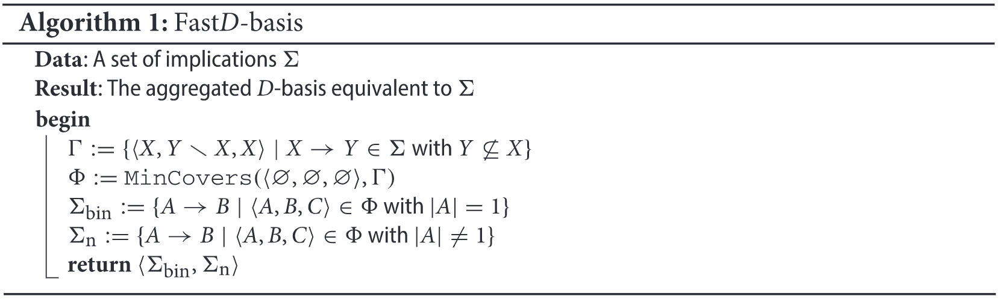

```{r setup, include=FALSE}
knitr::opts_chunk$set(
  collapse = TRUE,
  comment = "#>",
  fig.width = 7,
  fig.height = 5,
  warning = FALSE
)
```

# Introduction

This document is a Rmarkdown compiled file by the own Rstudio for seeing the two algorithms with a simple and didactic form that we are going to show.

These algorithms are based in the use of package fcaR to make Formal Concept Analysis (FCA). Thanks to this, we could find implications set analyzing from a dataframe. Once we found this set, we can use basic methods of simplifications to reduce the implication number of the set using canonical-basis, for example:

1.- We load the necessary libraries (`fcaR` and `Matrix`): 

```{r libraries}
library(usethis)
library(devtools)
library(fcaR)
library(Matrix)
devtools::load_all()
```

2.- We show the dataframe planets (presented in the vignette Implications.Rmd) incorporated in the package `fcaR` and the implications obtained:

```{r planets}
knitr::kable(planets, format = "html", booktabs = TRUE)
df <- planets
fc <- FormalContext$new(df)
fc$find_implications()
fc$implications
```

** Keep in mind that the find_implications() is based in the use of the algorithm `NextClosure` in formal concepts to extract implication basis.

3. From the implications set, we could simplify using logic operations like reduction, composition, generalization or simplification rules.

```{r simplification}
fc$implications$apply_rules(c("composition","generalization","simplification","reduction"))
```

# Use of the Direct-Optimal basis 

## Direct-Optimal Basis Basic Algorithm

It is recommended, to understand more in depth the mathematical concepts of this algorithm, look at the article:

> Estrella Rodríguez-Lorenzo, Karell Bertet, Pablo Cordero, Manuel Enciso, Ángel Mora (Available online 8 April 2018)
"Direct-optimal basis computation by means of the fusion of simplification rules"

Published in https://www.sciencedirect.com/science/article/abs/pii/S0166218X1730611X


The algorithm is based in the use of three functions:

** In all of the functions of this algorithm, is given an argument &Sigma;. In the article &Sigma; is expressed like a implications set, but in the script is expressed like a couple of sparse matrix (lhs and rhs) that shows in each column, the column number together with 1s in the positions where each attribute appears, respectly, as much in the left side (lhs) as in the right side (rhs).

```{r}
fc$implications
fc$implications[1]
fc$implications$get_LHS_matrix()
fc$implications$get_RHS_matrix()
Matrix(fc$implications$get_LHS_matrix()[,1], sparse = TRUE)
Matrix(fc$implications$get_RHS_matrix()[,1], sparse = TRUE)
```

### Add_sSimp function

The add_sSimp function takes as parameters two implications (in the script implemented as 4 columns sparse matrix) and the implications set &Sigma;, and it returns a set with an implication or an empty set.

<center></center>

### Simplify function

The simplify function takes as parameter &Sigma;, and it returns an simplified implications set equivalent to &Sigma;.

<center></center>

### Direct-Optimal Basis algorithm (SLgetdo Function)

The SLgetdo function takes as parameter  &Sigma;, and it returns an simplified implications set equivalent to &Sigma;. This function use the two previous mentioned functions. 

<center></center>

** We have to add that we use auxiliary functions to make operations between sets like .union, .difference2, ... (Implemented base). Nevertheless, for this algorithm, it was developed two auxiliary functions more:

  a) <b> A function to compare two column matrix (.matrixEquals(A,B)) </b> (Important!: we don't have to use to compare sets of cardinality greater than one, since in a set doesn't influence the order, so {a,b} = {b,a} and this feature is very inefficient to make with an brute-force algorithm).
  
  b) <b> A function to check if an element belongs of an set "domain" (.isElementOf_FDB(x, domain)) </b> that we use in the next algorithm.

Example to see the functioning (Obtained from the article in the introduction).

1) First, we check the input and the output of the algorithm.

```{r SLgetdo_1}
# Input
input <- system.file("Implications", "ex_implicationsDBO", package = "fcaR")
imp_in <- parse_implications(input)
imp_in

# Output
output <- system.file("Implications", "ex_implicationsDBO_sol", package = "fcaR")
imp_out <- parse_implications(output)
imp_out

```

2) Now, we introduce the input to the algorithm to check that it is equals.

```{r SLgetdo_2}
sigma_lhs <- imp_in$get_LHS_matrix()
sigma_rhs <- imp_in$get_RHS_matrix()
attr <- imp_in$get_attributes()

imp_simp <- .slGetDo(sigma_lhs,sigma_rhs)
res <- ImplicationSet$new(attributes = attr, lhs = imp_simp[[1]], rhs = imp_simp[[2]])
res
```


## More efficient algorithm (Fast Direct-Optimal Basis)

It is recommended, to understand more in depth the mathematical concepts of this algorithm, look at the article:

> Estrella Rodríguez-Lorenzo, Kira Adaricheva, Pablo Cordero, Manuel Enciso &
Angel Mora (2017) Formation of the D-basis from implicational systems using Simplification logic,
International Journal of General Systems, 46:5, 547-568, DOI: 10.1080/03081079.2017.1349632

Published in https://www.tandfonline.com/doi/full/10.1080/03081079.2017.1349632

The algorithm is based in the use of 6 functions:

** In all of the functions of this algorithm, it takes as parameter &Gamma;. In the article &Gamma; is expressed as a set that contains vectors like <X,Y,Z> where each element is an attributes set, but in the script &Gamma; is expressed like a sparse matrix where each column express an attributes set, for example: X<sub>1</sub>, Y<sub>1</sub>, Z<sub>1</sub>, X<sub>2</sub>, Y<sub>2</sub>, Z<sub>2</sub>, ...

### AddClosure function

The addClosure function takes as parameters an attributes set A and a set &Gamma; and it returns a 3-tuple of three attributes sets.

<center></center>

### Fix function

The fix function takes as parameters a 3-tuple of three attributes sets and a set &Gamma;, and it returns a list with a minimals set and a set &Gamma;<sub>new</sub>.

<center></center>

### Shorten function

The shorten function takes as parameters a 3-tuple of three attributes sets and a set &Gamma;, and it returns a new 3-tuple (if the set A have cardinality different to 1) or the same 3-tuple in other case.

<center></center>

### Join function

The join function takes as parameters two sets &Gamma; and it returns the union of the two sets, but simplified by the shorten function.

<center></center>

### MinCovers function

The mincovers function takes as parameters a 3-tuple of attributes and a set &Gamma; and it returns a set &Phi;.

<center></center>

### Fast-DBasis function

The .algorithm_FDB function takes as parameters am implications set &Sigma; and it returns a list with two implications set (One with all the implications with cardinality 1 &Sigma;<sub>bin</sub>, and the other without them &Sigma;<sub>n</sub>)

<center></center>

Example to see the functioning (Obtained from the article in the introduction).

1) First, we check the input and the output of the algorithm.

```{r FastD-Basis_1}
# Input
input <- system.file("Implications", "ex1", package = "fcaR")
imp_in <- parse_implications(input)
imp_in

# Output
output1 <- system.file("Implications", "ex1_bin", package = "fcaR")
imp_out_bin <- parse_implications(output1)
imp_out_bin

output2 <- system.file("Implications", "ex1_n", package = "fcaR")
imp_out_n <- parse_implications(output2)
imp_out_n

```

2) Now, we introduce the input to the algorithm to check that it is equals.

```{r FastD-Basis_2}
sigma_lhs <- imp_in$get_LHS_matrix()
sigma_rhs <- imp_in$get_RHS_matrix()
attr <- imp_in$get_attributes()
# 
# imp_simp <- .algorithm_FDB(sigma_lhs,sigma_rhs)
# res_bin <- ImplicationSet$new(attributes = attr, lhs = imp_simp[[1]], rhs = imp_simp[[2]])
# res_bin
# res_n <- ImplicationSet$new(attributes = attr, lhs = imp_simp[[3]], rhs = imp_simp[[4]])
# res_n
```

